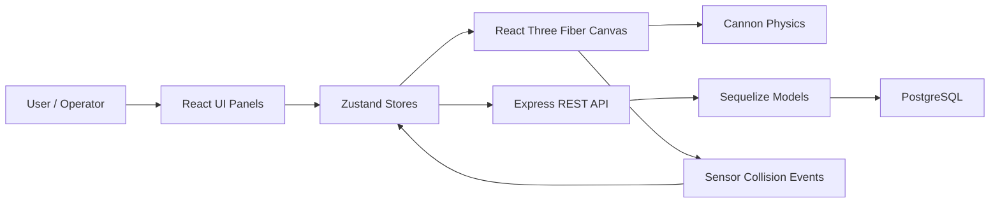
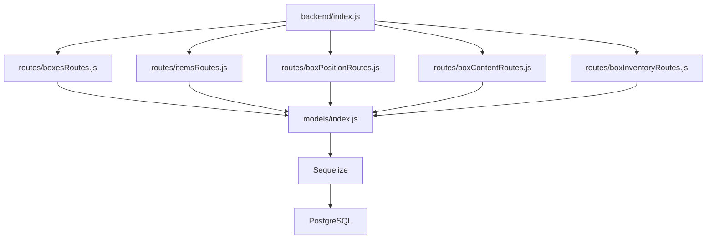
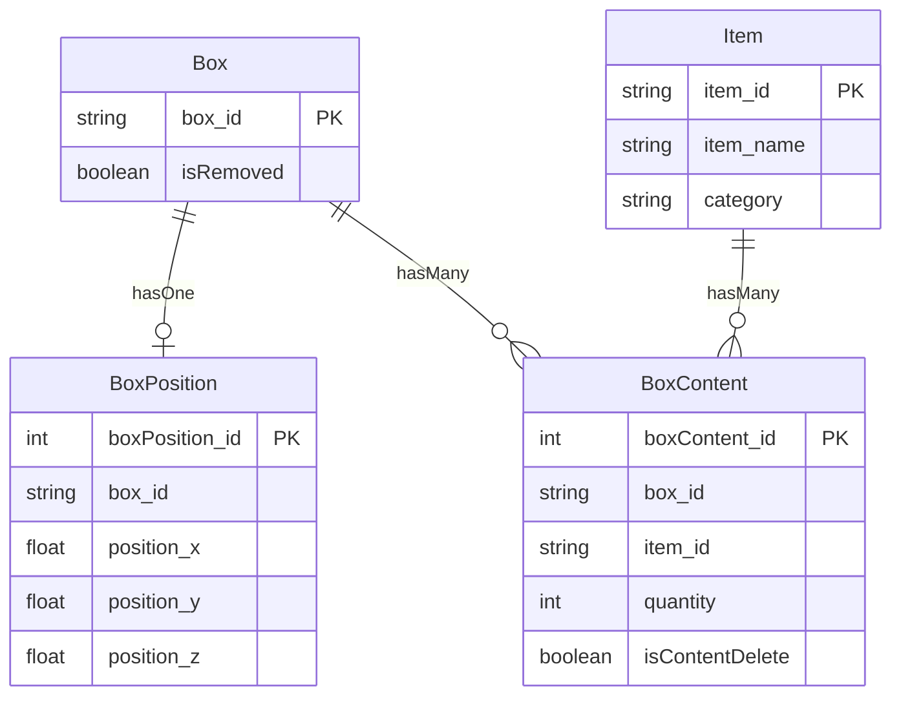

# Architecture

## High-level

## Frontend architecture

前端的核心是 `App.jsx`:

- DOM 面板: `SubPanelProduction.jsx`, `SubPanel.jsx`
- 3D Canvas: `@react-three/fiber` `Canvas`
- Physics world: `@react-three/cannon` `Physics`
- Scene graph: `Scene.jsx`
- State: Zustand stores

`Scene.jsx` 負責把靜態 layout data 轉成 3D 元件:

- `layoutData.conveyors` -> `ConveyorWithPhysics`
- `ShelfData.shelves` -> `VisualCullingShelfBatch`
- `CraneData.cranes` -> `Crane`

## Backend architecture

後端是 route-first Express app:

啟動流程:

1. `backend/index.js` require `./models`。
2. `models/index.js` 讀 `.env`，依 `DB_ENV` 選 local/cloud DB config。
3. 建立 Sequelize instance 與 models。
4. 設定 associations。
5. `sequelize.authenticate()`。
6. `sequelize.sync({ alter: true })`。
7. Express listen。

## Data model relationships

## Runtime state ownership

- DB owns persisted box/item/position/content data.
- `boxStore.boxesData` owns current frontend box map used for rendering.
- Cannon physics refs own real runtime world position of moving boxes.
- `boxEquipStore.boxCollisionStatus` owns runtime equipment occupancy inferred from sensor collision events.
- `craneStore` owns crane/move table current target state.
- `conveyorStore` owns conveyor rotate/speed/sensor/light state.
- `missionStore` owns mission/task/step execution state.

## Important coupling

- GLTF child names and authored transforms are logic contracts:
  - Conveyor: `Roller_`, `InvisibleBulkSensor`, `Light_bulb_0`. `Sensor_0`/`Sensor_1` are intentionally not instantiated as physics bodies.
  - Conveyor roller geometry uses local Y as its axle and is pre-rotated by the model. Preserve `rotateOnAxis(localY, step)` and the authored quaternion; direct scene-axis Euler increments are incorrect.
  - Crane: `movePlate`, `CraneInvisibleBulkSensor`
  - Shelf: `ShelfInvisibleBulkSensor`, `table`, `Leg_`
- `Inventory.jsx` shelf location depends on runtime sensor collision state, not only DB position.
- Box persisted position is updated explicitly by `updateBoxCurrentPositionServer()`, not continuously.
- Mission execution depends on exact `functionKey` names resolved by `src/missions/adapters/stepFunctions.js`.
