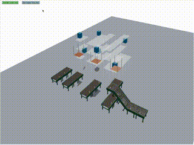

# 1. Project Title:

    3D Warehouse Management Web System (3D-WMS)
    

**Latest version:** 0.3  
👉 Try it yourself: [Live Demo on Firebase](https://r3f-gravity-apply-test.firebaseapp.com)

# 2. Problem Statement:

    Most traditional WMS provide summary and data. And a few of them have 2D map for the warehouse. 
    
But users are hard to find the correct location, when it comes to reality.

    ex: The Tissue is situated on the second floor of 2nd Warehouse, in aisle 15, shelf level 5 and 3 section.
    
    So we provide 3D warehouse management web system for solving this problem.   
    
    

 
ref: https://plm.sw.siemens.com/en-US/tecnomatix/plant-simulation-software/

Links to an external site.

 
# 3. Overview of the Application’s Functionality:

    Interactive 3D warehouse view for users. 
    
    Execute inventory inbound and outbound processes, and user can see the process simulation in 3D model.
    
    provide basic traditional WMS system functions. Ex: Inventory search, summary.
    
    
prototype:   https://warehouse-3d-simple-tryrun.web.app/

Links to an external site.

 
  Future extension: 
  
    create API and combine with hardware to make real-time 3D view. 
    
# 4. Technology Stack:

    Tech use:

	3D model for WebPage: Three.js.

	Frontend: React.js

	Backend: Express

  	DataBase: PostgreSQL

    Cloud deploy usage: 

	Frontend: Firebase

	Backend: Render

	DataBase: cloud DB provides by Render

# 5. Features to be Implemented:

Inventory inbound and outbound process,

Put inventory to different shelfs locations,

Gravity systems

Routing fix path algorithm, 

The item collision system.

Options: 

    Routing flexible path algorithm, 
    
 
# 6. User Stories:

Inventory inbound and outbound process

create box content

View the inventory contents

future features : 

	Change inventory locations 
	

# High-level architecture diagrams.

Frontend-backend interaction and database requirements.

Box position and add new Boxes.

Get all equipments location and status. 

Get dynamic position of all items. 

Get all inventory data.

# Database Schema Design

# API Contract

Box APIs		
Method	Endpoint	                Description

POST	/boxes	                    Create a new box

GET	    /boxes	                    Get all boxes

GET	    /boxes/:id	                Get a box by box_id

PUT	    /boxes/:id	                Update a box by box_id

DELETE	/boxes/:id	                Delete a box by box_id

PATCH	/boxes/:id/remove	        Soft-delete a box (set is
Removed = true)
PATCH	/boxes/all/remove	        Soft-delete all boxes

GET	    /boxes/:boxId/full	        Get full box data (position and contents)

GET	    /boxes/fullData	            Get full data of all boxes

PUT	    /boxes/:boxId/position	    Update box position by box_id

PUT	    /boxes/:boxId/content/:itemId	Update specific item in a box

BoxContent APIs

	
Method	Endpoint	Description

POST	/boxContents	Create a new box content record

GET	/boxContents	Get all box contents

GET	/boxContents/:id	Get a box content by boxContent_id

PUT	/boxContents/:id	Update a box content by boxContent_id

DELETE	/boxContents/:id	Delete a box content by boxContent_id

GET	/boxContents/box/:boxId	Get all contents for a specific box (excluding deleted items)

BoxPosition APIs

Method	Endpoint	Description

POST	/boxPositions	Create a new box position

GET	/boxPositions	Get all box positions

GET	/boxPositions/map	Get all valid box positions (excluding soft-deleted boxes)

GET	/boxPositions/mapFullData	Get full data of all valid boxes in map format

GET	/boxPositions/:id	Get a box position by boxPosition_id

PUT	/boxPositions/:id	Update a box position by boxPosition_id

DELETE	/boxPositions/:id	Delete a box position by boxPosition_id

GET	/boxPositions/box/:boxId	Get position by box_id

POST	/boxPositions/box/:boxId	Create position for a specific box (error if exists)

PATCH	/boxPositions/box/:boxId	Partially update position fields (x/y/z) of a box

Item APIs

		
Method	Endpoint	Description

POST	/items	Create a new item

GET	/items	Get all items

GET	/items/categories	Get all distinct item categories

GET	/items/category/:category	Get all items in a specific category

GET	/items/:id	Get an item by item_id

PUT	/items/:id	Update an item by item_id

DELETE	/items/:id	Delete an item by item_id

# Create Wireframes or UI mockups for the application’s key pages.

https://r3f-gravity-apply-test.web.app/

# d. create Wireframes or UI mockups for the application’s key pages.

ref: https://plm.sw.siemens.com/en-US/tecnomatix/plant-simulation-software/

Links to an external site.


ref https://www.netsuite.com/portal/products/erp/warehouse-fulfillment/wms.shtml
 
Links to an external site.




ref: https://www.amsc-usa.com/blog/warehouse-types-and-how-to-choose/
   
Links to an external site.

