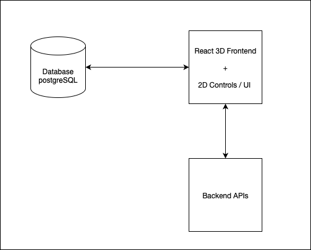

# 3D Warehouse Management System (3D-WMS)

**Version:** 0.8  
🔗 [Live Demo](https://r3f-gravity-apply-test.firebaseapp.com)  

---

## 🚩 Problem Statement

Traditional Warehouse Management Systems (WMS) usually provide text-based inventory data and, at most, 2D layouts. However, locating items in physical warehouses remains challenging.  
For example:  
> "Tissue is located on the 2nd floor of Warehouse #2, aisle 15, shelf level 5, section 3."  

This system addresses the challenge by offering a **3D web-based visualization** of warehouse operations and inventory.

---

## 🧭 Key Features

- 🧱 Interactive 3D warehouse view (camera and controls)
- 📦 Inbound / Outbound inventory process simulation
- 🔍 Real-time box content and inventory lookup
- 🧲 Physics-enabled object placement (gravity, collision)
- 🛣️ Fixed-path routing algorithm
- 🔧 Admin tools for creating, updating, removing box data

> **Coming Soon:**
> - Dynamic routing algorithm
> - Inventory relocation
> - Hardware integration (real-time 3D sync)

---

## 🖥️ Tech Stack

| Layer        | Technology         |
|--------------|--------------------|
| 3D Graphics  | Three.js           |
| Frontend     | React.js           |
| Backend      | Express.js         |
| Database     | PostgreSQL         |
| Hosting      | Firebase (frontend), Render (backend + DB) |

---

## 👥 User Stories

- As a warehouse operator, I can:
- Add new inventory boxes with content.
- Visualize item locations in 3D space.
- Track inbound and outbound processes.
- View box details including position and contents.

---

## 🧱 System Architecture

- 🔄 Frontend ↔ Backend API
- 🗃️ RESTful endpoints for all operations
- 📌 Real-time box positions + dynamic simulation data

---

## 🗃️ Database Schema Overview

This project uses a relational database structure designed for clarity, extensibility, and 3D inventory visualization. The core tables include:

- **boxes**: Basic unit for inventory, each with a unique `box_id`.
- **boxContents**: Defines the relationship between boxes and stored items, including quantity and soft-delete status.
- **boxPositions**: Stores spatial coordinates (`x, y, z`) of each box in the 3D warehouse.
- **items**: Master table of all item definitions.

### Relationships:

- One **box** has one **boxPosition**
- One **box** has many **boxContents**
- One **item** can be in many **boxContents**

All relationships are enforced with Sequelize associations and proper foreign key constraints.

---

## 📡 API Reference

### 📦 Box APIs

| Method | Endpoint                          | Description                          |
|--------|-----------------------------------|--------------------------------------|
| POST   | `/boxes`                          | Create a new box                     |
| GET    | `/boxes`                          | Get all boxes                        |
| GET    | `/boxes/:id`                      | Get a box by ID                      |
| PUT    | `/boxes/:id`                      | Update a box                         |
| DELETE | `/boxes/:id`                      | Delete a box                         |
| PATCH  | `/boxes/:id/remove`               | Soft delete a box                    |
| PATCH  | `/boxes/all/remove`               | Soft delete all boxes                |
| GET    | `/boxes/:boxId/full`              | Get full box data (position + items) |
| GET    | `/boxes/fullData`                 | Get full data for all boxes          |
| PUT    | `/boxes/:boxId/position`          | Update box position                  |
| PUT    | `/boxes/:boxId/content/:itemId`   | Update specific box item             |

### 📦 Box Content APIs

| Method | Endpoint                       | Description                           |
|--------|--------------------------------|---------------------------------------|
| POST   | `/boxContents`                 | Create a new box content record       |
| GET    | `/boxContents`                 | Get all box contents                  |
| GET    | `/boxContents/:id`             | Get box content by ID                 |
| PUT    | `/boxContents/:id`             | Update box content                    |
| DELETE | `/boxContents/:id`             | Delete box content                    |
| GET    | `/boxContents/box/:boxId`      | Get contents for a specific box       |

### 📍 Box Position APIs

| Method | Endpoint                                 | Description                            |
|--------|------------------------------------------|----------------------------------------|
| POST   | `/boxPositions`                          | Create a new box position              |
| GET    | `/boxPositions`                          | Get all box positions                  |
| GET    | `/boxPositions/map`                      | Get all valid positions (no soft-deleted) |
| GET    | `/boxPositions/mapFullData`              | Get full map data                      |
| GET    | `/boxPositions/:id`                      | Get position by ID                     |
| PUT    | `/boxPositions/:id`                      | Update position                        |
| DELETE | `/boxPositions/:id`                      | Delete position                        |
| GET    | `/boxPositions/box/:boxId`               | Get position by box ID                 |
| POST   | `/boxPositions/box/:boxId`               | Create position for a box              |
| PATCH  | `/boxPositions/box/:boxId`               | Partially update x/y/z coordinates     |

### 🧾 Item APIs

| Method | Endpoint                          | Description                            |
|--------|-----------------------------------|----------------------------------------|
| POST   | `/items`                          | Create a new item                      |
| GET    | `/items`                          | Get all items                          |
| GET    | `/items/categories`               | Get all item categories                |
| GET    | `/items/category/:category`       | Get items in a specific category       |
| GET    | `/items/:id`                      | Get an item by ID                      |
| PUT    | `/items/:id`                      | Update an item                         |
| DELETE | `/items/:id`                      | Delete an item                         |

---

## 🖼️ Version List 

**Version:** 0.8  
🔗 [Live Demo](https://r3f-gravity-apply-test.firebaseapp.com)  

**Version:** 0.2  
🔗 [Prototype Demo](https://warehouse-3d-simple-tryrun.web.app/)

---

## 🔍 References

- Siemens Plant Simulation: https://plm.sw.siemens.com/en-US/tecnomatix/plant-simulation-software/  
- NetSuite WMS: https://www.netsuite.com/portal/products/erp/warehouse-fulfillment/wms.shtml  
- Warehouse Layout Reference: https://www.amsc-usa.com/blog/warehouse-types-and-how-to-choose/

---
