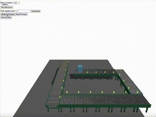

# 1. Project Title:

    3D Warehouse Management Web System (3D-WMS)
    

**Latest version:** 0.3  
👉 Try it yourself: [Live Demo on Firebase](https://r3f-gravity-apply-test.firebaseapp.com)

# 2. Problem Statement:

    Most traditional WMS provide summary and data. And a few of them have 2D map for the warehouse. 
But users are hard to find the correct location, when it comes to reality.

    ex: The Tissue is situated on the second floor of 2nd Warehouse, in aisle 15, shelf level 5 and 3 section.
    So we provide 3D warehouse management web system for solving this problem.   
    

 
ref: https://plm.sw.siemens.com/en-US/tecnomatix/plant-simulation-software/
Links to an external site.
 
# 3. Overview of the Application’s Functionality:

    Interactive 3D warehouse view for users. 
    Execute inventory inbound and outbound processes, and user can see the process simulation in 3D model.
    provide basic traditional WMS system functions. Ex: Inventory search, summary.
    
prototype:   https://warehouse-3d-simple-tryrun.web.app/
Links to an external site.
 
  Future extension: 
    create API and combine with hardware to make real-time 3D view. 
# 4. Technology Stack:

3D model for WebPage: Three.js.
Frontend: React.js
Backend: under consideration

# 5. Features to be Implemented:

Inventory inbound and outbound process,
Put inventory to different shelfs locations,
Routing path algorithm, 
The item collision system.

Options: 
    Gravity systems
 
# 6. User Stories:

Inventory inbound and outbound process
Change inventory locations 
View the inventory contents

# High-level architecture diagrams.

Frontend-backend interaction and database requirements.
Box position and add new Boxes.
Get all equipments location and status. 
Get dynamic position of all items. 
Get all inventory data.

# Database Schema Design

# API Contract
“Only example”

Add box:

Request: 
POST /api/boxes
{
  "position": [0, 3, 0],
  "size": [1, 1, 1]
}

Response: 
{
  "id": "box123",
  "position": [0, 3, 0],
  "size": [1, 1, 1],
  "status": "created"
}

b. Get layouts  

Request:
GET /api/layouts/current

Response:
{
  "id": "layout001",
  "conveyors": [
    {"id": "conv1", "position": [-4,0,4], "rotation": [0, 1.57, 0]},
    ...
  ]
}

c. Change conveyor speed:
Request: 
POST /api/rollers/roller123/speed
Content-Type: application/json
{
  "speed": 40
}

Response: 
{
  "rollerId": "roller123",
  "speed": 40,
  "status": "updated"
}

# Create Wireframes or UI mockups for the application’s key pages.

https://r3f-gravity-apply-test.web.app/

# d. create Wireframes or UI mockups for the application’s key pages.

ref: https://plm.sw.siemens.com/en-US/tecnomatix/plant-simulation-software/
Links to an external site.


ref https://www.netsuite.com/portal/products/erp/warehouse-fulfillment/wms.shtml
Links to an external site.



ref: https://www.amsc-usa.com/blog/warehouse-types-and-how-to-choose/
Links to an external site.

