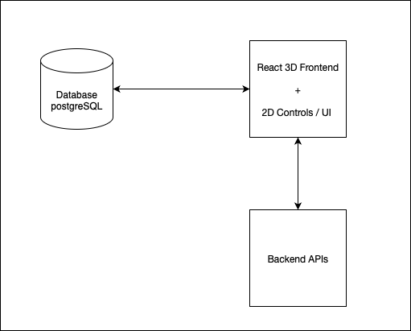

# 3D Warehouse Management System (3D-WMS)

## Latest Version — 450-Location AS/RS Warehouse

A fresh recording of the integrated `main` version: 450 storage locations, optimized shelf rendering and physics, and the latest fitted crane mesh with synchronized travel, lift and telescopic forks. Follow one box through automated inbound storage and outbound retrieval.

https://github.com/user-attachments/assets/75d21e07-e9d5-4084-870f-a2c4fedaab75

**[▶ Watch the latest demo — 62 seconds](https://github.com/user-attachments/assets/75d21e07-e9d5-4084-870f-a2c4fedaab75)** · 1080p / 30 fps · Real project footage

## Project Evolution — From Prototype to Optimized Automation

The project's journey from its first conveyor prototype, through gravity and physics, 90-location automation, and 450-location performance optimization, to the latest crane integration. This is the corrected edition with a freshly recorded single-box crane sequence.

https://github.com/user-attachments/assets/02e1741e-af2d-492e-be50-0fe25fc85724

**[▶ Watch the project evolution — 70 seconds](https://github.com/user-attachments/assets/02e1741e-af2d-492e-be50-0fe25fc85724)** · 1080p / 30 fps · English titles

[Recording provenance and reproduction scripts](./tools/video/latest/README.md)

---

🔗 [Live Demo](https://r3f-gravity-apply-test.firebaseapp.com)  

🔗 [Hosted Backend](https://threed-warehouse-management-system.onrender.com)


---

## Quick Start

### Prerequisites

- Node.js 18 or newer
- npm
- `just` is optional. It provides shorter commands, but every `just` recipe has an equivalent `npm` command.
- PostgreSQL is optional. A fresh clone runs with the built-in SQLite demo database when no backend env file is provided.

### Run the App

The easiest local setup uses the built-in SQLite demo database, so you do not need PostgreSQL.

```bash
npm run setup:all
npm run dev:all
```

Then open `http://localhost:5173`.

If you use `just`, the same flow is:

```bash
just setup
just dev
```

### Frontend Only

The frontend defaults to the local backend at `http://localhost:3002`, so a new clone can run without creating a root `.env` file.

```bash
npm install
npm run dev
```

Optional frontend env files:

- Copy `.env.example` to `.env` when you want to override local development settings.
- Copy `.env.production.example` to `.env.production` before a production build if you want the Firebase build to use the hosted backend.

Important: `VITE_*` variables are bundled into browser JavaScript. Do not put PostgreSQL URLs, usernames, passwords, or other secrets in root frontend env files.

### Backend Only

The backend runs on port `3002` by default. If `backend/.env` is missing, it uses a local SQLite demo database at `backend/data/warehouse.sqlite`, so a new clone can run without installing PostgreSQL.

```bash
cd backend
npm install
npm start
```

Optional backend env files:

- Skip `backend/.env` for the easiest demo setup. The backend will create and use the ignored SQLite file automatically.
- Copy `backend/.env.example` to `backend/.env` when you want to customize SQLite, local PostgreSQL, Render PostgreSQL, or `DATABASE_URL`.
- Run `npm run reset:demo` inside `backend` to delete the local SQLite demo database and start fresh.

Database selection rules:

1. `DATABASE_URL`, when present, is used first.
2. `DB_ENV=cloud` uses the legacy Render-compatible `PG_HOST`, `PG_USER`, `PG_PASSWORD`, `PG_DATABASE`, `PG_PORT`, and `PG_DIALECT` settings.
3. `DB_ENV=local` uses the legacy local `PG_*_LOCAL` settings.
4. `DB_ENV=sqlite` or `DB_ENV=demo` uses the local SQLite file.
5. If neither `DATABASE_URL` nor `DB_ENV` is set, the backend falls back to SQLite demo mode.

This keeps existing Render deployments working while allowing new users to run the full API without installing PostgreSQL.

The app also includes a top-right `DB` switcher for local development. It can switch the running backend between local SQLite, local PostgreSQL, and cloud PostgreSQL. PostgreSQL options are tested before switching; after a successful switch, the page reloads so frontend state is fetched from the newly selected database. The switcher API is enabled automatically only for localhost requests. Set `ENABLE_DB_SWITCHER=true` only on trusted private servers.

The hosted Render backend can take a few seconds to respond after it has been idle.

---

## 🚩 Problem Statement

Traditional Warehouse Management Systems (WMS) usually provide text-based inventory data and, at most, 2D layouts. However, locating items in physical warehouses remains challenging.  
For example:  
> "Tissue is located on the 2nd floor of Warehouse #2, aisle 15, shelf level 5, section 3."  

This system addresses the challenge by offering a **3D web-based visualization** of warehouse operations and inventory.

---

## 🧭 Key Features

- 🧱 Interactive 3D warehouse view (camera and controls)
- 📦 Inbound / Outbound inventory process simulation
- 🔍 Real-time box content and inventory lookup
- 🧲 Physics-enabled object placement (gravity, collision)
- 🛣️ Fixed-path routing algorithm
- 🔧 Admin tools for creating, updating, removing box data

> **Coming Soon:**
> - Dynamic routing algorithm
> - Inventory relocation
> - Hardware integration (real-time 3D sync)

---

## 🖥️ Tech Stack

| Layer        | Technology         |
|--------------|--------------------|
| 3D Graphics  | Three.js           |
| Frontend     | React.js           |
| Backend      | Express.js         |
| Database     | SQLite demo fallback, PostgreSQL |
| Hosting      | Firebase (frontend), Render (backend + DB) |

---

## 👥 User Stories

- As a warehouse operator, I can:
- Add new inventory boxes with content.
- Visualize item locations in 3D space.
- Track inbound and outbound processes.
- View box details including position and contents.

---

## 🧱 System Architecture



- 🔄 Frontend ↔ Backend API
- 🗃️ RESTful endpoints for all operations
- 📌 Real-time box positions + dynamic simulation data

---

## 🗃️ Database Schema Overview

This project uses a relational database structure designed for clarity, extensibility, and 3D inventory visualization. The core tables include:

- **boxes**: Basic unit for inventory, each with a unique `box_id`.
- **boxContent**: Defines the relationship between boxes and stored items, including quantity and soft-delete status.
- **boxPosition**: Stores spatial coordinates (`position_x`, `position_y`, `position_z`) of each box in the 3D warehouse.
- **items**: Master table of all item definitions.

### Relationships:

- One **box** has one **boxPosition**
- One **box** has many **boxContent** records
- One **item** can be in many **boxContent** records

All relationships are defined with Sequelize associations and are created automatically during backend startup when the configured database is empty.

---

## 📡 API Reference

### 📦 Box APIs

| Method | Endpoint                          | Description                          |
|--------|-----------------------------------|--------------------------------------|
| POST   | `/boxes`                          | Create a new box                     |
| GET    | `/boxes`                          | Get all boxes                        |
| GET    | `/boxes/:id`                      | Get a box by ID                      |
| PUT    | `/boxes/:id`                      | Update a box                         |
| DELETE | `/boxes/:id`                      | Delete a box                         |
| PATCH  | `/boxes/:id/remove`               | Soft delete a box                    |
| PATCH  | `/boxes/all/remove`               | Soft delete all boxes                |

### 📦 Box Inventory APIs

| Method | Endpoint                                      | Description                          |
|--------|-----------------------------------------------|--------------------------------------|
| GET    | `/boxInventory/:boxId/full`                   | Get full box data (position + items) |
| GET    | `/boxInventory/fullData`                      | Get full data for all boxes          |
| PUT    | `/boxInventory/:boxId/position`               | Update box position                  |
| PUT    | `/boxInventory/:boxId/content/:itemId`        | Update specific box item             |

### 📦 Box Content APIs

| Method | Endpoint                       | Description                           |
|--------|--------------------------------|---------------------------------------|
| POST   | `/boxContents`                 | Create a new box content record       |
| GET    | `/boxContents`                 | Get all box contents                  |
| GET    | `/boxContents/:id`             | Get box content by ID                 |
| PUT    | `/boxContents/:id`             | Update box content                    |
| DELETE | `/boxContents/:id`             | Delete box content                    |
| GET    | `/boxContents/box/:boxId`      | Get contents for a specific box       |

### 📍 Box Position APIs

| Method | Endpoint                                 | Description                            |
|--------|------------------------------------------|----------------------------------------|
| POST   | `/boxPositions`                          | Create a new box position              |
| GET    | `/boxPositions`                          | Get all box positions                  |
| GET    | `/boxPositions/map`                      | Get all valid positions (no soft-deleted) |
| GET    | `/boxPositions/mapFullData`              | Get full map data                      |
| GET    | `/boxPositions/:id`                      | Get position by ID                     |
| PUT    | `/boxPositions/:id`                      | Update position                        |
| DELETE | `/boxPositions/:id`                      | Delete position                        |
| GET    | `/boxPositions/box/:boxId`               | Get position by box ID                 |
| POST   | `/boxPositions/box/:boxId`               | Create position for a box              |
| PATCH  | `/boxPositions/box/:boxId`               | Partially update x/y/z coordinates     |

### 🧾 Item APIs

| Method | Endpoint                          | Description                            |
|--------|-----------------------------------|----------------------------------------|
| POST   | `/items`                          | Create a new item                      |
| GET    | `/items`                          | Get all items                          |
| GET    | `/items/categories`               | Get all item categories                |
| GET    | `/items/category/:category`       | Get items in a specific category       |
| GET    | `/items/:id`                      | Get an item by ID                      |
| PUT    | `/items/:id`                      | Update an item                         |
| DELETE | `/items/:id`                      | Delete an item                         |

### 🗄️ Database Switcher APIs

These APIs power the top-right `DB` switcher. They are enabled automatically for localhost requests. On a trusted private server, set `ENABLE_DB_SWITCHER=true` to enable them.

| Method | Endpoint      | Description                                      |
|--------|---------------|--------------------------------------------------|
| GET    | `/db/status`  | Get the active database dialect and config type  |
| POST   | `/db/test`    | Test a SQLite or PostgreSQL connection payload   |
| POST   | `/db/switch`  | Switch the running backend to the tested database |

---

## 🖼️ Demo Links

🔗 [Current Live Demo](https://r3f-gravity-apply-test.firebaseapp.com)

🔗 [Earlier Prototype Demo](https://warehouse-3d-simple-tryrun.web.app/)

---

## 🔍 References

- Siemens Plant Simulation: https://plm.sw.siemens.com/en-US/tecnomatix/plant-simulation-software/  
- NetSuite WMS: https://www.netsuite.com/portal/products/erp/warehouse-fulfillment/wms.shtml  
- Warehouse Layout Reference: https://www.amsc-usa.com/blog/warehouse-types-and-how-to-choose/

---

## Fitted AS/RS crane assets

The warehouse uses a pallet stacker crane fitted to the existing 2 m shelf grid and 1 m box envelope. The crane body, double-tine fork, and rail are separate GLB assets, so the rail can be repeated indefinitely along X. Runtime uses the subtle grey `asrs_single_guide_rail_4m.glb`; the wider train-style `asrs_ground_rail_4m.glb` remains available as a preserved alternative.

Regenerate and verify:

    blender --background --factory-startup --python tools/blender/create_fitted_asrs_assets.py
    blender --background --factory-startup --python tools/blender/validate_fitted_asrs_assets.py
    npm run test:crane-fit
    npm run test:mission-production-factory

Editable source: assets/blender/asrs_stacker_crane_fitted.blend

Reference render: assets/previews/asrs_stacker_crane_fitted.png

## Integrated 450-location AS/RS version

The local integrated version combines the 18 × 5 × 5 shelf layout, instanced
rack visuals and aggregated row physics with the fitted AS/RS crane and
anchored telescopic forks. Rails cover the full 36 m storage length, and the
11.7 m mast clears the highest storage level.

Validation details: [combined warehouse validation](docs/combined-warehouse-validation.md).
